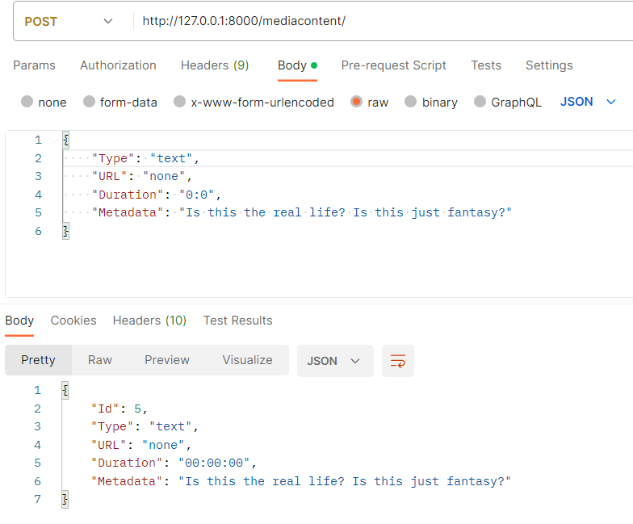
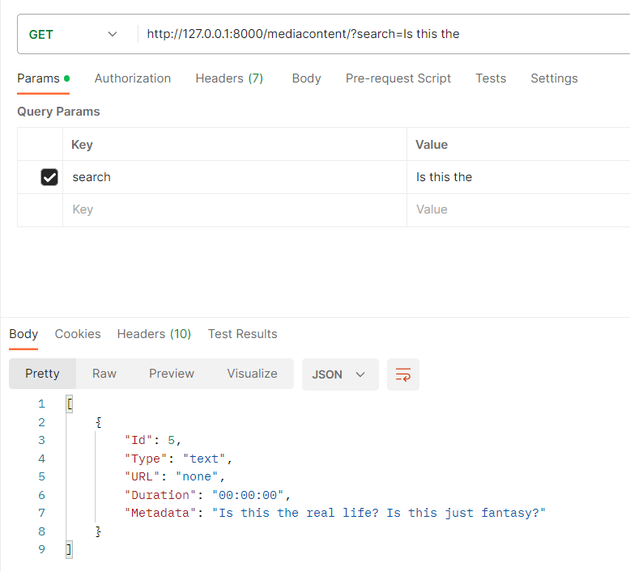

# Тестування працездатності системи
Тестування буде проводитись з використанням сервісу Postman. В якості тестів, будуть надіслані ряд POST та GET запросів для перевірки працювання системи реєстрації, авторизаціїї, додавання та пошуку медіа-контенту.
## Система реєстарції

**Спробуємо додати такий ж самий логін**

**Лог консолі сервера:**

**Результат у БД:**

## Система авторизації
**Авторизуємось у систему за логіном "Alex" та "Testlogin":**

**Спробуємо надіслати невірний пароль:**

**Лог консолі сервера:**

## Система обробки медіаданих:
**Додамо новий текст:**

**Результат у БД:**

**Пошук:**

